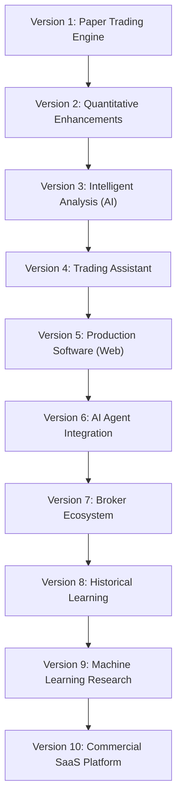

# RISE Trader - Long-Term Product Roadmap & Evolution Plan

## 1. Long-Term Product Vision
RISE Trader is conceived not as a static script or a one-time exercise, but as the foundation of a highly modular, professional-grade financial analytics and decision-support product. While Version 1 focuses strictly on a simple, rule-based paper-trading flow, the long-term goal is to build an extensible platform that can seamlessly scale to support advanced analytics, machine learning models, portfolio risk systems, and eventually, a commercial SaaS ecosystem.

The system is designed with scalability in mind. Although future capabilities (such as AI agents, live trading, and multi-user access) will not be built in the initial release, the requirements of Version 1 are structured to allow these additions as pluggable components without requiring massive re-writes of the core calculation and data-collection logic.

---

## 2. Product Evolution Roadmap

The product will evolve across ten distinct versions, with each version representing a step forward in sophistication, capabilities, and system intelligence.

### Version 1: Paper Trading Engine (Current Focus)
* **Objective**: Build a reliable, rule-based stock recommendation engine to validate strategies risk-free.
* **Core Deliverables**:
  * Scrapes NIFTY 50 universe using Yahoo Finance.
  * Calculates Volume Ratio, VWAP, Opening Range Breakout (ORB), and Relative Strength.
  * Employs a basic Ranking Engine.
  * Broadcasts recommendations via Telegram.
  * Logs all recommendation data to track and audit performance.

### Version 2: Quantitative Enhancements
* **Objective**: Improve the quality of stock recommendations using evidence collected during paper trading.
* **Possible Additions**:
  * Technical indicators: RSI, MACD, EMA, ATR.
  * Sector Strength and Market Trend Analysis.
  * Enhanced scoring algorithms.
  * Automated daily analytics reports.
  * Highly configurable strategy parameters and finer-grained logging.

### Version 3: Intelligent Analysis
* **Objective**: Introduce contextual and intelligent market analysis.
* **Possible Additions**:
  * Financial news analysis and earnings report analysis.
  * AI-generated natural language explanations for recommendations.
  * Confidence scoring based on text and indicator alignment.
  * Awareness of corporate events (splits, dividends) and economic calendars.

### Version 4: Trading Assistant
* **Objective**: Provide end-to-end assistance for daily trading routines.
* **Possible Additions**:
  * Portfolio tracking and position sizing recommendations.
  * Risk management engine.
  * Stop-loss and profit-target suggestions.
  * Customized user watchlists and a digitised trade journal.

### Version 5: Production Software
* **Objective**: Transition from a terminal/script interface to a robust web-based software application.
* **Possible Additions**:
  * Modern Web Dashboard.
  * User Authentication (sign-up, login, permissions).
  * Interactive historical recommendation databases and chart visualizations.
  * REST API backend (e.g., using FastAPI).
  * Containerized deployment (Docker) and Cloud hosting.
  * Relational database integration (PostgreSQL).

### Version 6: AI Agent Integration
* **Objective**: Transform the platform into an autonomous AI Agent.
* **Possible Additions**:
  * AI planning and multi-step reasoning capabilities.
  * Tool calling and automated analytical workflows.
  * Daily news summarization and market explanation engine.
  * Personalized, user-specific stock recommendations.

### Version 7: Broker Ecosystem
* **Objective**: Integrate with real brokerage APIs to transition from paper trading to execution.
* **Possible Additions**:
  * Official broker API integrations.
  * Simulated paper order execution.
  * Live portfolio synchronization.
  * Automated/semi-automated trade execution (strictly user-approved and enabled).

### Version 8: Historical Learning
* **Objective**: Learn from system performance to improve future recommendations.
* **Possible Additions**:
  * In-depth trade analytics and win/loss analysis.
  * Performance comparisons of different indicators and strategies.
  * Backtesting and strategy optimization suites.
  * Automated risk and performance reports.

### Version 9: Machine Learning Research
* **Objective**: Incorporate predictive model training and pattern recognition.
* **Possible Additions**:
  * Feature engineering pipelines.
  * Training of historical predictive models.
  * Algorithmic pattern recognition.
  * Quantitative machine learning ranking models.
  * Automated strategy-to-strategy performance comparisons.

### Version 10: Commercial SaaS Platform
* **Objective**: Scalable multi-tenant cloud offering for commercial users.
* **Possible Additions**:
  * Multi-user support with tenant isolation.
  * Tiered subscription plans and billing integration.
  * Team and organizational dashboards.
  * Developer API access keys.
  * Mobile applications (iOS and Android).
  * Enterprise deployment options.

---

## 3. Engineering Philosophy

To ensure that the system can evolve through these ten versions without requiring major architectural redesigns, the project must adhere to a strict set of engineering guidelines from day one.

### Modular Architecture
* **Interface-Driven Design**: Core behaviors (such as data collection, indicator calculation, and message delivery) should be defined by abstract interfaces. For instance, swapping Yahoo Finance for a premium broker data feed (Version 7) should only require writing a new data collector module that implements the existing scraper interface, leaving the ranking engine untouched.
* **Pluggable Scoring System**: The scoring and ranking engine should operate as a separate module, allowing developers to switch from simple summation scores (Version 1) to machine-learning-based scoring (Version 9) by swapping the scorer module.

### Core Principles
1. **SOLID Principles**:
   * *Single Responsibility (SRP)*: A module should do one thing. For example, the Telegram notifier should only handle message formatting and delivery; it should not calculate indicators.
   * *Open/Closed (OCP)*: The codebase should be open for extension but closed for modification. New indicators (like RSI or ATR in Version 2) should be added by writing new indicator classes rather than editing the core scanning runner.
   * *Liskov Substitution (LSP)*: Derived classes must remain substitutable for their base classes.
   * *Interface Segregation (ISP)*: Modules should not be forced to depend on interfaces they do not use.
   * *Dependency Inversion (DIP)*: High-level policy (e.g., the recommendation logic) should not depend on low-level details (e.g., how Yahoo Finance formats its CSVs). Both must depend on abstractions.
2. **Separation of Concerns**: Data fetching, analytical math, ranking policies, output notifications, and auditing logs are separate concerns that must occupy separate directories/files.
3. **Testability**: The logic of indicator calculation and stock ranking must be decoupled from time, filesystems, and network connections so they can be 100% verified using unit tests.
4. **Documentation-First Development**: All modules must maintain clear, up-to-date documentation. APIs, assumptions, and configuration structures must be written down before coding begins.

---

## 4. Success Definition
The ultimate success of RISE Trader is defined across multiple dimensions and is not solely measured by short-term trading profits:

* **Production-Quality Architecture**: The codebase is stable, thoroughly tested, easy to read, and conforms to industry-standard Python formatting and design patterns.
* **Reusable Financial Analytics Abstraction**: The core calculations and scoring modules can be easily reused in other financial engineering or research contexts.
* **Learning and Skill Mastery**: Serves as a masterclass platform for learning quantitative finance, real-time data parsing, API integration, background automation, and Clean Architecture.
* **Commercial Viability Foundation**: Demonstrates a statistically significant positive expectancy (win rate and profit factor) during the paper-trading validation phase, proving it has a viable edge to justify future roadmap phases.
