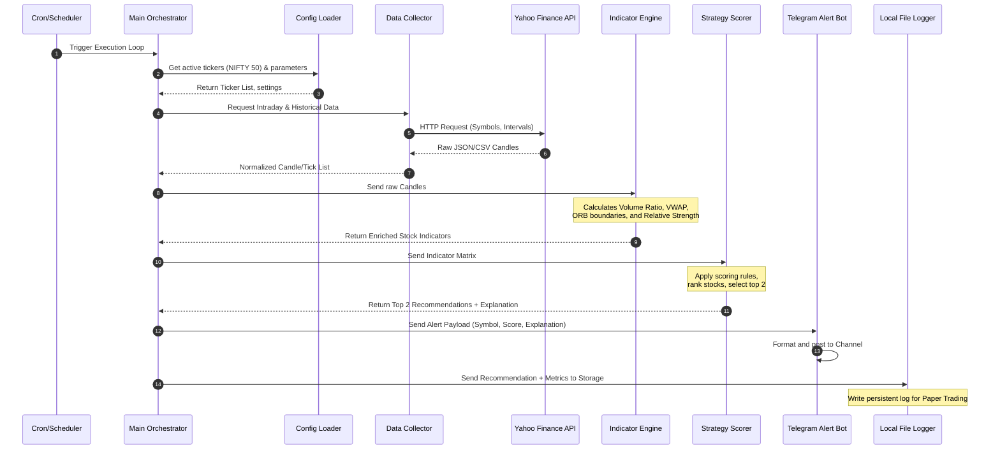

# RISE Trader - System Data Flow Specification

This document details how data moves through the RISE Trader system during a single execution run. It maps the journey of price and volume data from external sources, through calculations and ranking algorithms, to notifications and performance audits.

---

## 1. Sequence Flow Overview

The diagram below shows how the orchestrator manages data flow between modules.



---

## 2. Step-by-Step Data Journey

### Step 1: External Source to Collector
* **Action**: The system initiates an HTTP query to Yahoo Finance.
* **Payload**: Includes ticker symbols (50 constituents + NIFTY index), interval size (e.g., 5-minute candles), and history range.
* **Data State**: Raw, unparsed JSON string or CSV payload directly from Yahoo Finance servers.

### Step 2: Collector to Indicators Module
* **Action**: The Data Collector parses the response, instantiates domain schemas, and validates input datatypes.
* **Payload**: A dictionary mapping each ticker symbol to a chronological list of `Candle` entities (Open, High, Low, Close, Volume, Timestamp).
* **Data State**: Cleaned, typed domain models in memory.

### Step 3: Indicators Module to Strategy Module
* **Action**: The calculation engine processes the list of candles for each stock and the NIFTY index to compute quantitative values.
* **Calculations**:
  * **Volume Ratio**: The current candle's volume divided by the historical average volume for the same period.
  * **VWAP**: Cumulative volume-weighted price.
  * **ORB**: High and Low values of the designated opening range.
  * **Relative Strength**: Outperformance spread compared to the NIFTY index candle array.
* **Payload**: An enriched stock model containing the original prices plus decimal values for `volume_ratio`, `vwap`, `orb_high`, `orb_low`, and `relative_strength`.
* **Data State**: Evaluated mathematical structures.

### Step 4: Strategy Module to Ranking Engine
* **Action**: The Strategy Scorer compares the calculated indicators against rule thresholds.
* **Scoring**: Applies scoring rules (e.g., if Close > VWAP, score +1; if Close > ORB High, score +2).
* **Payload**: An array of stocks with their accumulated score values.
* **Data State**: Scored dataset.

### Step 5: Ranking Engine to Outputs (Alerts & Paper Trading)
* **Action**: The orchestrator sorts the scored array, filters candidates, and selects the top 2 stocks.
* **Decision**: Calculates the confidence percentage and generates a plain-text selection explanation based on which indicators triggered the score.
* **Payload**: A `Recommendation` domain object:
  ```json
  {
    "timestamp": "2026-06-29T09:45:00Z",
    "recommendations": [
      {
        "symbol": "TCS",
        "confidence_score": 85,
        "explanation": "Volume Ratio (2.5) above threshold; breakout above ORB High (3250.0); trading above VWAP."
      },
      {
        "symbol": "RELIANCE",
        "confidence_score": 80,
        "explanation": "Relative Strength outperforming NIFTY index; trading above VWAP."
      }
    ]
  }
  ```
* **Data State**: Finalized recommendation decisions.

### Step 6: Outputs to Telegram & Local File Logger
* **Action**: The orchestrator sends the recommendation to both adapters concurrently:
  * **Telegram Notifier**: Formats the JSON into a clean, markdown-enabled message and POSTs it to the Telegram Bot API.
  * **Local Storage Adapter**: Serializes the data and appends it to the paper-trading tracker log file (`recommendations.csv` or `recommendations.json`).
* **Data State**: Delivered communication alerts and persisted auditing logs.

### Step 7: Logs to Reports
* **Action**: When triggered by the user or an end-of-day scheduler, the performance use-case parses the historical paper-trading logs, calculates P&L stats, and writes out a summary report detailing win rates and average profits.
* **Data State**: Consolidated strategy performance intelligence.
